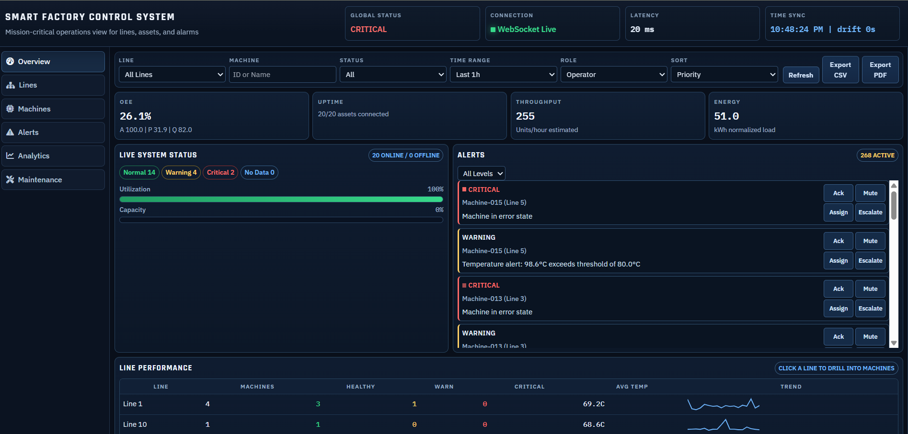
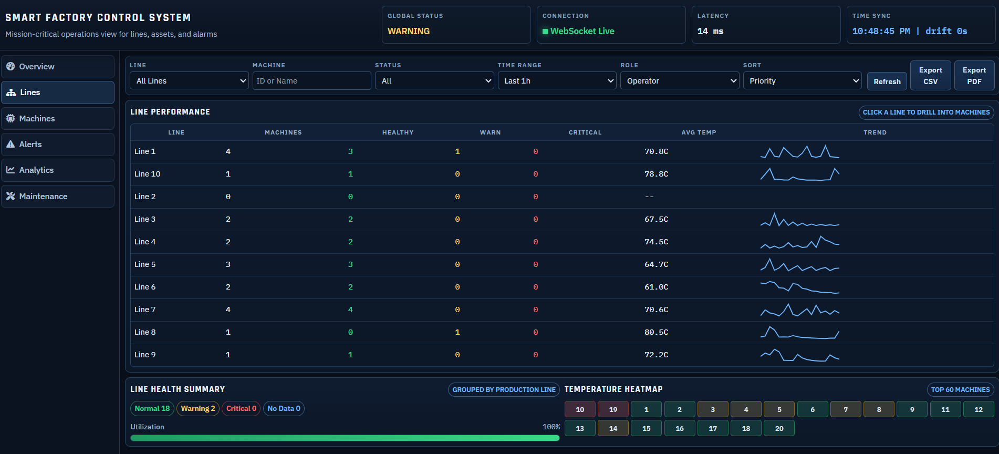
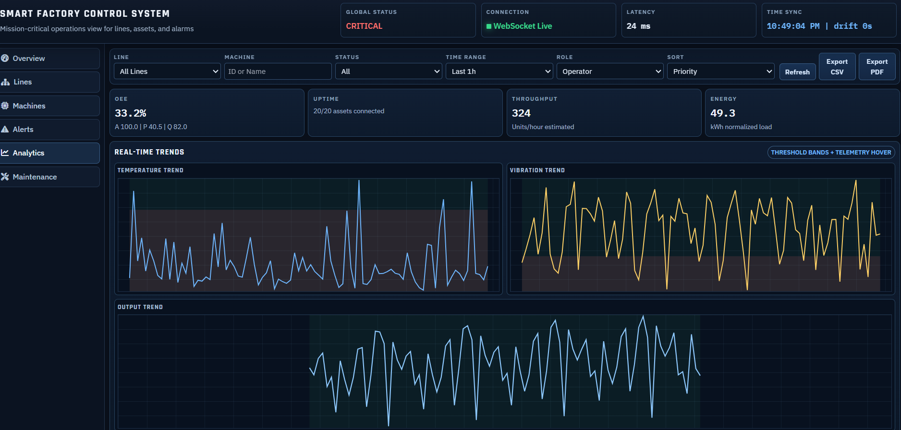

# Smart Factory Industrial Dashboard

## 1. Clone Project
```bash
git clone https://github.com/ahmad2200385/industrial_dashboard.git
cd industrial_dashboard
```

## 2. Run with Docker (First)
```bash
docker compose up --build -d
```

## Run `populate.py`

From Docker container:
```bash
docker compose exec api python populate.py --machines 20 --create-missing --mode api --api-base-url http://127.0.0.1:8000
```

## 3. Run Locally (Without Docker)
Make sure PostgreSQL and Redis are already running.

Backend:
```bash
cd backend
pip install -r requirements.txt
alembic upgrade head
uvicorn main:app --host 0.0.0.0 --port 8003 --reload
```

Frontend (new terminal):
```bash
cd frontend
npm install
npm run dev -- --host 0.0.0.0 --port 3000
```

## 4. Run `populate.py` (Manual)
From host:
```bash
python backend/populate.py --machines 20 --create-missing --mode api --api-base-url http://localhost:8003
```

##  5. Ports
- Frontend: `http://localhost:3000`
- API (host): `http://localhost:8003`
- API Docs: `http://localhost:8003/api/docs`
- API inside Docker container: `http://127.0.0.1:8000`

## 6. Start Scripts (Use at the End)
Use these only if you want one-command startup.

Linux/macOS:
```bash
./start.sh
./start.sh local
```

Windows PowerShell:
```powershell
.\start.ps1
.\start.ps1 local
```

## 7. Screenshots
### Overview


### Lines


### Analytics


## 8. Author
**Ahmad**  
Smart Factory Industrial Dashboard

## 9. License
This project is licensed under the **MIT License**.

For full details: [PROJECT_DETAILS.md](./PROJECT_DETAILS.md)
